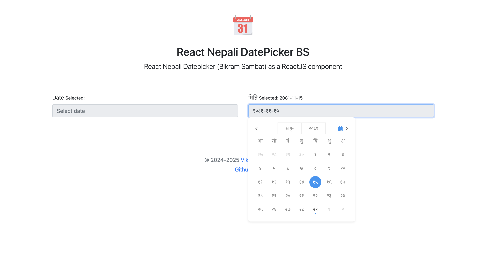
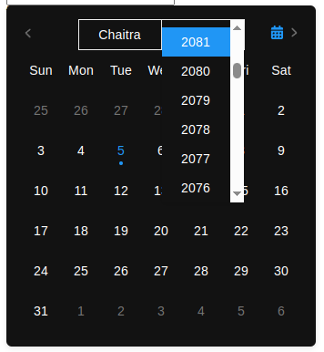
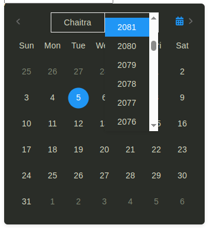

# React Nepali Datepicker

> Nepali Datepicker as a ReactJS input component with popover

[](https://www.npmjs.com/package/react-nepali-datepicker-bs)
[](https://standardjs.com)

## Demo

### Theme: "light" (default)



### Theme: "dark"



### Theme: "forest"



## Install

```bash
npm install --save react-nepali-datepicker-bs

or,

yarn add react-nepali-datepicker-bs
```

## Usage

#### For Typescript

```tsx
import React, { useState } from "react"
import { NepaliDatePicker } from "react-nepali-datepicker-bs"
import "react-nepali-datepicker-bs/dist/index.css"

const App = () => {
    const [dateEnglish, setDateEnglish] = useState<string>("")

    return (
        <form>
            <label htmlFor='date'>Date</label>
            <NepaliDatePicker
                inputClassName='form-control'
                value={dateEnglish}
                onChange={(date: string) => setDateEnglish(date)}
                options={{ calenderLocale: "en" }}
                placeholder='Select date'
                // true if you want to enable the input date to be current date by default
                todayIfEmpty={false}
                // size for the week day label in the calendar popover
                weekDayLabelSize='md'
                // available themes = 'light' | 'dark' | 'forest'
                theme='dark'
                formatOptions={{
                    separator: "-",
                    format: "YYYY-MM-DD",
                }}
            />
        </form>
    )
}

export default App
```

#### For JavaScript

```jsx
import React, { useState } from "react"
import { NepaliDatePicker } from "react-nepali-datepicker-bs"
import "react-nepali-datepicker-bs/dist/index.css"

const App = () => {
    const [dateNepali, setDateNepali] = useState("")

    return (
        <form>
            <label htmlFor='date'>Date</label>
            <NepaliDatePicker
                inputClassName='form-control'
                value={dateNepali}
                onChange={(date: string) => setDateNepali(date)}
                options={{ valueLocale: "en" }}
                placeholder='Select Date'
                todayIfEmpty={false}
                weekDayLabelSize='md'
                theme='light'
            />
        </form>
    )
}

export default App
```

## Reference

MIT © [https://github.com/puncoz-official](https://github.com/puncoz-official)
